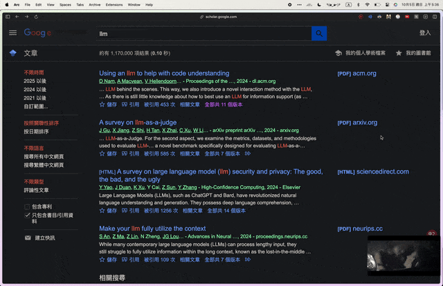

# ScholarRanks

[中文說明（台灣正體）](README.zh-TW.md)

## Project Overview
ScholarRanks focuses on two deliverables:
- **Chrome extension** – surfaces conference rankings alongside Google Scholar search results.
- **Data collection scripts** – export ConferenceRanks.com data and produce the JSON consumed by the extension.

## Directory Layout
- `extension/scholar-rank/`: Chrome extension source code, datasets, and styling assets.
- `scripts/`: Python utilities managed with uv, including the ConferenceRanks scraper.
- `README.zh-TW.md`: Taiwanese Traditional counterpart of this document.

## Quick Start
### Install the Chrome Extension
1. Open `chrome://extensions` and enable **Developer mode**.
2. Click **Load unpacked** and select the `extension/scholar-rank/` folder.
3. Visit [https://scholar.google.com](https://scholar.google.com); if a venue matches the dataset, a ranking badge appears under the result metadata.

### Refresh the Conference Dataset
1. From the `scripts/` directory, run `uv run conferenceranks_scraper.py --verbose`. The command downloads ConferenceRanks data and overwrites `extension/scholar-rank/data/conferences.json`.
2. Reload the Chrome extension to pick up the updated dataset. Use `--output` or `--stdout` if you want to inspect or archive alternative copies.

## Development Notes
- Extend or post-process the dataset via the scraper; the extension reads `data/conferences.json` at runtime.
- Python tooling depends on `requests` and `beautifulsoup4`, both managed automatically by uv.
- Follow your standard git workflow to review and commit changes after updates.

## TODO
- Add more conference rank sources (e.g., CORE, Google Scholar Metrics).
- Expand venue aliases and rankings beyond the demo seed data.
- Automate transforming scraper output (e.g., scheduled scraper runs) so the dataset stays fresh.
- Add automated checks (lint/tests) to guard future changes.
